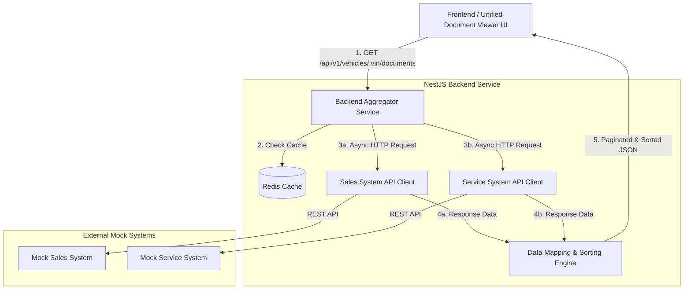

# SYSTEM DESIGN DOCUMENT: UNIFIED VEHICLE DOCUMENT VIEWER

## 1. Architecture Diagram

The system is designed based on the **API Gateway / Aggregator Pattern**. The NestJS Backend acts as an Orchestrator, responsible for receiving requests from the Frontend, communicating in parallel with external Mock APIs via HTTP Clients, and handling data transformation, aggregation, and pagination before responding to the UI.

## 2. Component Descriptions

* **Unified Document Viewer UI (Frontend):** The single user interface. It accepts a `VIN` from the user, invokes the unified backend API, and displays the document list. The UI utilizes the `source` property in the response payload to render distinctive badges (e.g., Green for Sales, Red for Service).
* **Backend Aggregator Service (NestJS Core):** The single entry-point of the system. It handles input validation, orchestrates asynchronous API calls, and processes the core business logic for data aggregation, sorting, and pagination.
* **Cache Service (Redis Client):** A helper service layer interacting with Redis. It mitigates overhead on external Mock APIs by storing cached responses for each source individually, using the `VIN` as the unique identifier key.
* **External API Clients (Axios Clients):** Isolated HTTP Clients configured with dedicated timeouts and retry mechanisms, specialized in communicating with two independent downstream systems: *Sales System API* and *Service System API*.
* **Data Mapping & Sorting Engine:** The core domain logic layer responsible for mapping heterogeneous schemas from both mock sources into a standardized Data Transfer Object (Unified Schema), while performing in-memory sorting and pagination.

## 3. Data Flow Explanation

Detailed data flow when a user searches for vehicle documents using a Vehicle Identification Number (VIN):

1. **Request & Validation:** The user enters a VIN on the UI. The Frontend dispatches a request:
`GET /api/v1/vehicles/{vin}/documents?page=1&size=10`.
NestJS utilizes `ValidationPipe` (coupled with `class-validator`) to validate the VIN format (17 alphanumeric characters). If invalid, it immediately returns a `400 Bad Request`.
2. **Cache Lookup:** The `DocumentService` invokes the `CacheService` to concurrently look up two separate keys in Redis: `cache:sales:{vin}` and `cache:service:{vin}`.
3. **Parallel Fetching & Cache Miss Handling:**

* If data exists in Redis (**Cache Hit**), it is retrieved directly from memory.
* In case of a **Cache Miss**, the system leverages asynchronous concurrency (`Promise.all` or `async/await`) to simultaneously trigger concurrent HTTP Axios requests to both external Mock APIs.
4. **Data Transformation (Mapping) & Tagging:** Upon fetching the data (either from Cache or live Mock APIs), the Engine maps the disparate downstream schemas into a single unified DTO structure and explicitly injects a source tag: `source: "Sales System"` or `source: "Service System"`.
5. **In-Memory Sorting & Pagination:**

* **Sorting:** The system merges the documents from both sources and sorts them in descending chronological order based on the `timestamp` field directly in memory.
* **Pagination (Slicing):** Based on the `page=1` and `size=10` query parameters, the system slices the sorted array to retrieve exactly the 10 most recent documents.
6. **Response:** The system returns an HTTP JSON Response `200 OK` containing the paginated document list along with pagination metadata (`totalRecords`, `currentPage`, `totalPages`) back to the Frontend.

## 4. Technology Stack & Justifications

| Component | Chosen Technology | Technical Justification |
| --- | --- | --- |
| **Core Framework** | **NestJS (v10+)** | Provides a highly structured, module-based architecture, robust Dependency Injection, and an Aspect-Oriented Programming (AOP) paradigm to cleanly encapsulate cross-cutting concerns (Validation, Filters, Interceptors). |
| **Language** | **TypeScript** | Ensures strict type safety, which is crucial when defining a unified DTO for aggregating data from multiple non-standardized external schemas. |
| **Runtime & Async** | **Node.js (Async/Await)** | Optimized for I/O-bound tasks (parallel external HTTP API execution) thanks to its non-blocking, event-driven architecture. |
| **HTTP Client** | **Axios (via `@nestjs/axios`)** | Offers powerful Interceptors to automatically inject Correlation-IDs into headers, allows strict timeout configurations (e.g., 3s), and supports Cancel Tokens to prevent cascading system bottlenecks. |
| **Caching Store** | **Redis (via `ioredis`)** | High-performance, in-memory key-value store providing sub-millisecond (<1ms) read/write latencies. Perfect for short-term caching to shield mock downstream APIs from repetitive traffic. |
| **API Documentation** | **OpenAPI / Swagger** | Dynamically integrated via NestJS decorators (`@nestjs/swagger`) within Controllers and DTOs. The API documentation is automatically generated and updated in real-time at the `/api/docs` endpoint. |

## 5. Architectural Strategies & Implementation Details

### A. Caching Strategy (Per-Source Caching)

Based on domain analysis of dealership operations (Sales data has a very low update frequency; Service data has a medium-to-high update frequency), the system implements an isolated per-source caching strategy instead of global caching:

* **Implementation Layer:** A clean, explicit `CacheService` helper class is created and injected into the `DocumentService`.
* **Sales Cache:** The key `cache:sales:{vin}` is configured with a **long TTL (24 hours)**.
* **Service Cache:** The key `cache:service:{vin}` is configured with a **short TTL (30 minutes)**.
* *Benefit:* When a vehicle goes in for maintenance and its service history updates, the system only invalidates/overwrites the Service cache every 30 minutes, while the static Sales data (purchase contract) remains safely cached for 24 hours, saving substantial network bandwidth and downstream CPU resources.

### B. Fault Tolerance Strategy

* **Graceful Degradation:** Downstream API failures are treated as **Warnings**, not critical System Errors. If the Sales API encounters a 500 error or a timeout, the system logs a warning and proceeds to aggregate data exclusively from the Service API. This ensures a seamless user experience instead of crashing the entire client request.
* **Circuit Breaker:** Integrated via the `opossum` library at the Axios Client layer. If the failure rate of a specific Mock API exceeds 50% within a 5-minute window, the Circuit Breaker trips into an **Open State**. Subsequent requests are immediately blocked at the Gateway layer and fail fast with an empty array to conserve system resources, while simultaneously triggering a critical metric alert.

## 6. Observability Strategy

### A. Logging (Structured Logging)

* Implemented using **Pino** (via `nestjs-pino`) to output logs in structured JSON format, making them easily searchable and parsable by centralized log aggregators (ELK Stack, Grafana Loki).
* **Correlation ID Middleware:** A custom middleware automatically intercepts or generates a unique `X-Correlation-Id` (UUID) for every incoming request. This ID is transitively attached to every log line generated during the request lifecycle (including Axios external requests), enabling seamless end-to-end debugging.

### B. Metrics

The system integrates `nestjs-prometheus` to expose an internal `/metrics` endpoint, tracking critical golden signals:

* `http_request_duration_seconds` (Histogram): Measures the overall latency of the main API Gateway.
* `external_dependency_duration_seconds` (Histogram): Separately tracks the latency of the downstream *Sales API* and *Service API*.
* `redis_cache_hit_ratio` (Counter): Tracks the cache hit/miss ratio to evaluate and fine-tune TTL efficiency.

### C. Tracing (Distributed Tracing)

* The **OpenTelemetry SDK** is initialized at the NestJS application startup to automatically capture execution Spans.
* Every incoming request spawns a root span. When `Promise.all` triggers parallel Axios requests, the SDK automatically attaches two parallel child spans under the root span. This allows developers to visually inspect execution bottlenecks (external downstream latency vs. internal CPU processing) inside APM tools like Jaeger or SigNoz.

### D. Periodic Health Check (Active Proactive Monitoring)

* Leverages `@nestjs/terminus` combined with `@nestjs/schedule` to run a background cron job every 2 minutes.
* This background worker executes lightweight "pings" to the Mock APIs and Redis to actively monitor infrastructure health. The health metrics are decoupled from the live request runtime, serving solely to feed operational Grafana dashboards and trigger automated Slack/PagerDuty alerts before real users experience system degradation.

## 7. Generative AI Assistance Section

Throughout the architectural design phase, GenAI was utilized as an **Architect Co-pilot** to refine system capabilities and guide engineering trade-offs:

* **Domain-Driven Caching Design:** Assisted in analyzing update frequencies of automotive Sales and Service domains, leading to the decision to use an isolated Per-Source Cache strategy (24h vs. 30m TTLs) over a monolithic cache.
* **Heterogeneous Data Pagination:** Facilitated the comparative analysis between *In-Memory Pagination* and *Cursor-Based Pagination*, concluding that an in-memory approach is highly optimized and safe given the typical dataset size of a single vehicle VIN.
* **Modular NestJS Architecture Planning:** Guided the encapsulation of cross-cutting concerns (Circuit Breaker, Per-Source Cache, Structured Logging, and Health Checks) into dedicated, reusable NestJS constructs (Services, Middlewares, Pipes), ensuring the codebase strictly aligns with SOLID and DRY design principles.

---

